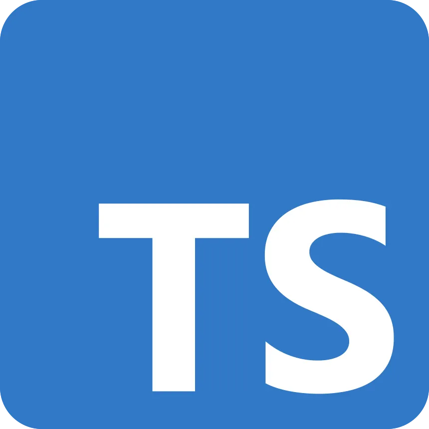
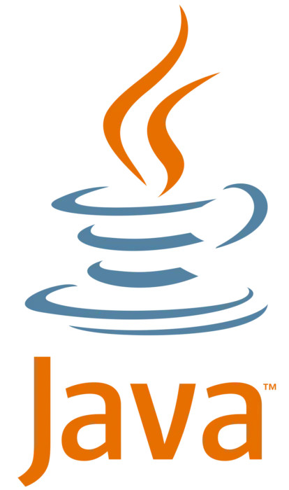
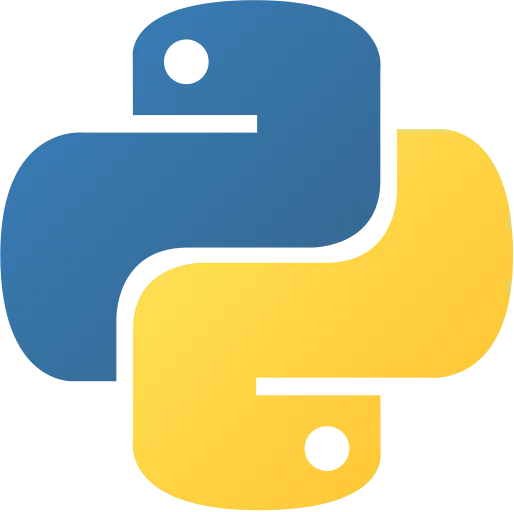
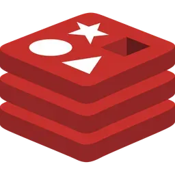

# Aether

O Aether nasceu em 2026, como resultado de um projeto interdisciplinar escolar desenvolvido no Instituto J&F. Nesse projeto, tivemos contato direto com responsáveis de sustentabilidade das empresas do Grupo J&F e realizamos diversas pesquisas que comprovaram a necessidade de um novo aplicativo com foco na sustenabilidade. 

Nosso aplicativo é voltado para auxiliar empresas na transição rumo a práticas mais sustentáveis, alinhadas ao Objetivo de Desenvolvimento Sustentável 12 (Consumo e Produção Responsável). Seu principal propósito é reduzir a emissão de gases poluentes, como o CO2 e metano, por meio do incentivo  ao uso de alternativas verdes como o hidrogênio e conscientização corporativa sobre os benefícios ambientais e econômicos da sustentabilidade.

## Tecnologias utilizadas

  
  
  
  
  
  
  
  
  
  
  
  
  

## Autores

O projeto foi desenvolvido por duas equipes principais:

Os alunos do 1º ano que idealizaram o projeto e desenvolveram parte do projeto:
- Caio Campelo Rocha;
- Lais Casteluci Almeida;
- Luiz Miguel Félix Ferreira;
- Miguel Juvillar de Souza Pinheiro;
- Rafaella Rosa Silva Santos.

E o 2º ano que desenvolveram o restante do projeto:
- Caio Marcos Ambrósio Maciel;
- Eduardo Costa Amex Macal;
- Fernanda Nogueira Nagata;
- Isabelly Vila Silva da Hora;
- Pedro Henrique Casarini Alves;
- Vinícius Vilas Boas.

## Documentação
Para acessar documentações mais detalhadas e obter mais entendimento sobre as partes implementadas durante a  construção do projeto, acesse o README dos repositórios: 

- [Toolskit]("https://github.com/AetherGases/aether-toolskit")
- [Docs]("https://github.com/AetherGases/aether-docs")
- [User Experience]("https://github.com/AetherGases/aether-user-experience.git")
- [Landing]("https://github.com/AetherGases/aether-landing.git")
- [Administrative]("https://github.com/AetherGases/aether-web-administrative.git")
- [Mobile]("https://github.com/AetherGases/aether-mobile.git")
- [Core API]("https://github.com/AetherGases/aether-core-api.git")
- [Business Inteligence]("https://github.com/AetherGases/aether-analytics.git")
- [AI SDK]("https://github.com/AetherGases/aether-ai-sdk.git")
- [AI Gateway]("https://github.com/AetherGases/aether-ai-gateway.git")
- [Web Flow]("https://github.com/AetherGases/aether-web-flow.git")

## Acesso ao Aether

Para usar o aplicativo Aether, a empresa deve assinar um dos planos de serviço. Após a contratação, todos os funcionários requeridos para a inserção de dados, análise de relatórios e gerentes de sustentabilidade poderão acessar a plataforma, que conterá com permissionamento personalizado para cada indústria.

## Suporte

Para suporte, mande um email para grupoaetherjef@gmail.com